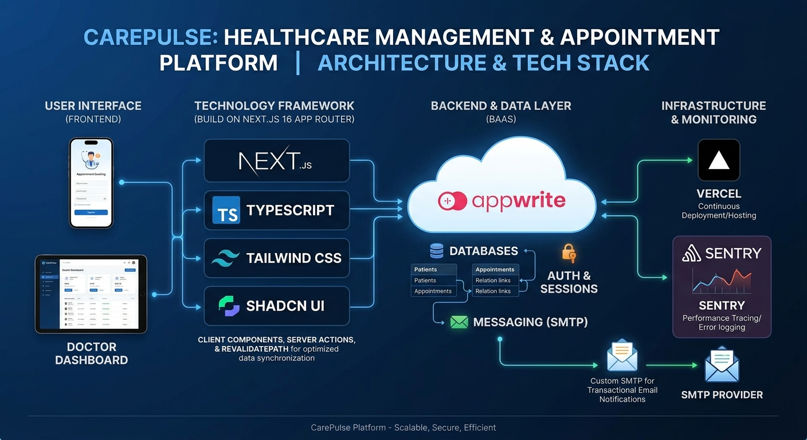

<p align="center">
  
</p>

# 🏥 CarePulse - Healthcare Management & Appointment Platform

A modern, cloud-based healthcare management platform designed to streamline patient registration, appointment scheduling, and medical records management. Built with performance, security, and mobile responsiveness at its core.

---

## 🌟 Key Features

- **Patient & Appointment Management:** Easily register patients, schedule appointments, and manage status updates seamlessly with precise data relational mapping.
- **Transactional Email Notifications:** Integrated automated appointment confirmations and alerts using **Appwrite Messaging with Custom SMTP**.
- **Real-Time UI Synchronization:** Built with Next.js **Server Actions** and `revalidatePath` strategies to bypass client-side router caching and reflect new data instantly across mobile and desktop devices.
- **Fixed Dark Mode UI:** Designed with **Shadcn UI** and Tailwind CSS, enforcing a consistent dark-theme experience to prevent light-mode flickering on mobile viewports.
- **Production Monitoring & Error Tracking:** Integrated with **Sentry** for real-time performance tracking and error logging in production.

---

## 🛠️ Tech Stack

### **Frontend & Framework**
- **Framework:** Next.js 16 (App Router)
- **Language:** TypeScript
- **Styling & Components:** Tailwind CSS, Shadcn UI
- **State & Theme Management:** `next-themes`

### **Backend & Infrastructure**
- **BaaS / Database:** Appwrite (Auth, Databases, and Messaging)
- **Email Delivery:** Custom SMTP Provider
- **Deployment:** Vercel
- **Monitoring:** Sentry

---

## 🚀 Getting Started

### Prerequisites

Ensure you have Node.js (v18+) and npm/pnpm installed.

### 1. Clone the Repository

```bash
git clone [https://github.com/your-username/healthcare-app.git](https://github.com/your-username/healthcare-app.git)
cd healthcare-app